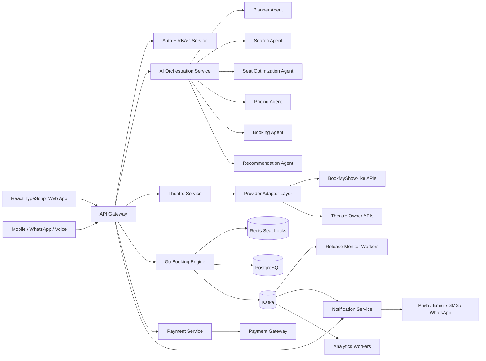

# Ticketly Autonomous Booking Platform - HLD

## Product Goal

Ticketly is an AI-powered booking assistant for high-demand movie releases. It reduces manual refresh/search effort by monitoring inventory, ranking theatres, recommending grouped seats, creating temporary holds, and guiding one-click checkout.

## Enterprise Architecture

## Core Services

| Service | Responsibility | Runtime |
| --- | --- | --- |
| API Gateway | Routing, rate limits, request IDs, auth forwarding | Nginx/Kong/Envoy |
| Auth Service | JWT, OAuth, OTP, RBAC, audit logs | FastAPI |
| AI Orchestration | Intent, planning, tool calling, memory, workflow state | FastAPI + LangGraph |
| Theatre Service | Movies, theatres, screens, shows, seat layouts | FastAPI |
| Booking Engine | seat locks, idempotent reservation, confirmation, retries | Go |
| Payment Service | payment intents, webhook verification, PCI boundary | FastAPI/Go |
| Notification Service | queue-based alerts, templates, delivery tracking | FastAPI workers |
| Recommendation Service | theatre ranking, seat ranking, personalization | Python |
| Provider Adapter Service | provider-specific search, pricing, layout, reserve APIs | Python/Go |

## Event Topics

| Topic | Producer | Consumers |
| --- | --- | --- |
| `release.monitor.tick` | scheduler | release monitor |
| `inventory.detected` | provider adapter | AI, notification, analytics |
| `booking.reserve.requested` | AI/Frontend | booking engine |
| `booking.reserve.completed` | booking engine | payment, notification |
| `booking.reserve.failed` | booking engine | retry worker, AI recovery |
| `payment.completed` | payment | booking engine |
| `notification.dispatch.requested` | AI/booking | notification service |
| `agent.workflow.event` | AI orchestration | tracing, analytics |

## High Availability Strategy

PostgreSQL is the source of truth. Redis stores short-lived locks and hot inventory cache. Kafka decouples monitoring spikes from booking execution. Booking confirmation uses idempotency keys, optimistic checks against persisted bookings, and short TTL seat holds. Provider failures are isolated with adapter-level circuit breakers, retries, and cached fallback inventory.

