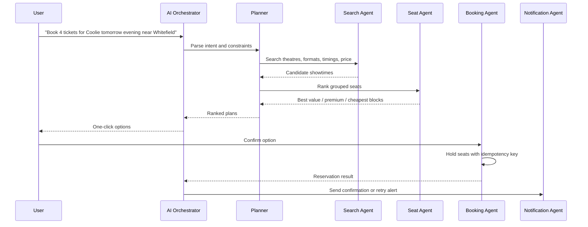

# Low-Level Design

## Seat Locking

1. User or Booking Agent requests a seat hold with `showtime_id`, seats, session key, and idempotency key.
2. Booking Engine acquires Redis locks: `seat:{showtime_id}:{seat_id}` with a TTL.
3. Engine verifies no confirmed booking exists in PostgreSQL.
4. Engine writes `SeatHold(status=ACTIVE, expires_at=now+TTL)`.
5. If payment succeeds before expiry, hold becomes `CONFIRMED` and booking is persisted.
6. Expired holds are released by a worker and ignored by seat map reads.

## Seat Recommendation Formula

```
score = 1 - (
  row_distance_from_ideal * 0.42 +
  center_alignment_distance * 0.38 +
  price_penalty * 0.20
) + popularity_bonus
```

The service returns:

- `best_overall`
- `best_value`
- `premium_experience`

## Agent Workflow



## Provider Adapter Contract

Each provider implements:

- `search_showtimes`
- `fetch_seat_layout`
- `reserve`
- `confirm`

Adapters own provider credentials, throttling, retry rules, circuit breaker state, response normalization, and provider-specific error mapping.

## RBAC

| Role | Scope |
| --- | --- |
| `SUPER_ADMIN` | global users, theatre approvals, policies, analytics |
| `THEATRE_OWNER` | owned theatres, screens, seats, shows, offers |
| `USER` | preferences, searches, bookings, payments, cancellations |

